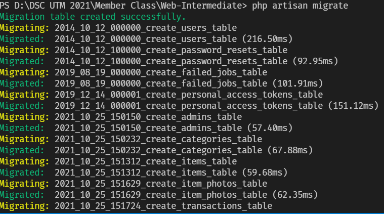
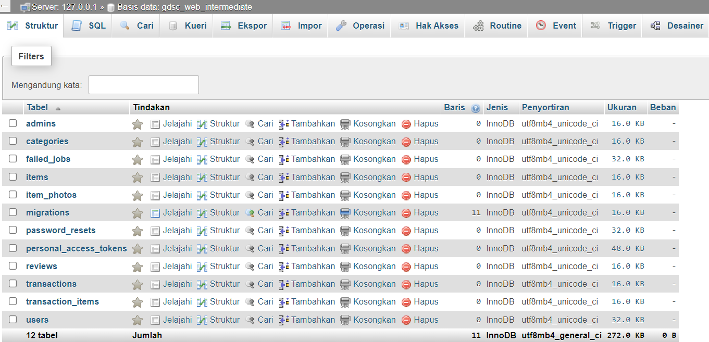
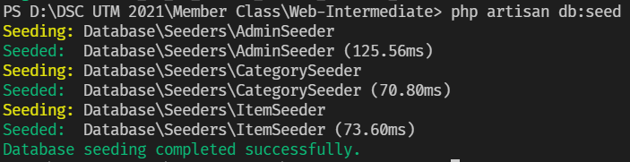

<h2>Topik Bahasan</h2>

- [ ] Struktur Folder Laravel
- [ ] Migrasi & Seeder Laravel
- [ ] Mengenal Model di Laravel
- [ ] Mengenal Controller di Laravel
- [ ] Mengenal View di Laravel


<h2>
    Tools yang harus diinstall
</h2>

- XAMPP (Windows)
- Apache & Phpmyadmin (Linux)
- VSCode (Windows & Linux)

<br>
<h2>
    Cara Instalasi
</h2>

1. Buka Terminal
2. Jalankan git command

```
git clone git@github.com:gdsctrunojoyo/Web-Intermediate.git
```

3. Pindah ke direktori **Web-Intermediate**
4. Jalankan command berikut untuk menginstall package composer

```
composer install
```
5. Jalankan command berikut untuk generate key
```
php artisan key:generate
```
6. Copy .env.example ke .env
7. Ubah data berikut untuk menyesuaikan config database mysql

```
DB_DATABASE=nama_db
DB_USERNAME=username_db
DB_PASSWORD=pass_db
```

8. Jalankan aplikasi laravel
```
php artisan serve
```
9. Buka browser di localhost:8000


<h2>
List Command
</h2>


untuk membuat tabel model, controller dan migration

```
php artisan make:model Categories -mcr
```
untuk migrasi struktur tabel dari file database/migrations/ ke database MySQL

```
php artisan migrate
```


<br/>


untuk insert seeder / data sample yang sudah didefinisikan di database/seeders/

```
php artisan db:seed
```


